# 🎯 TaskFlow - A Productivity Powerhouse

### Developed by:
## 🧑‍💻 **Fady Gerges Kodsy Al Sagheer**

<p align="center">
  
</p>

---

## 📌 Table of Contents
1. [✨ Overview](#overview)
2. [🚀 Features](#features)
   - 🌟 [Splash Screen](#splash-screen)
   - 📌 [Main Screen (My Day)](#main-screen-my-day)
   - ⭐ [Important Screen](#important-screen)
   - 📅 [Planned Screen](#planned-screen)
   - ❤️ [Favorite Screen](#favorite-screen)
   - 📋 [All Tasks Screen](#all-tasks-screen)
   - 🎨 [Custom Task Lists](#custom-task-lists)
   - ✏️ [Task Editing](#task-editing)
   - 🔔 [Notifications](#notifications)
   - 🎭 [Theme Switching](#theme-switching)
   - 🎬 [Animations](#animations)
   - 🔄 [Drag-and-Drop Reordering](#drag-and-drop-reordering)
   - ⚙️ [Account Settings](#account-settings)
3. [🛠 Technologies Used](#technologies-used)
4. [📥 Installation](#installation)
5. [🤝 Contributing](#contributing)
6. [📜 License](#license)
7. [👨‍💻 About the Developer](#about-the-developer)

---

## ✨ Overview
🔹 **TaskFlow** is a modern **to-do list** application built with **Flutter**, offering a smooth UI, stunning animations, and robust functionality powered by **BLoC architecture**. Whether managing daily tasks, prioritizing important items, or planning for the future, **TaskFlow** ensures an intuitive and seamless experience.

💡 **Developed with passion by Fady Gerges Kodsy.**

---

## 🚀 Features

### 🌟 Splash Screen
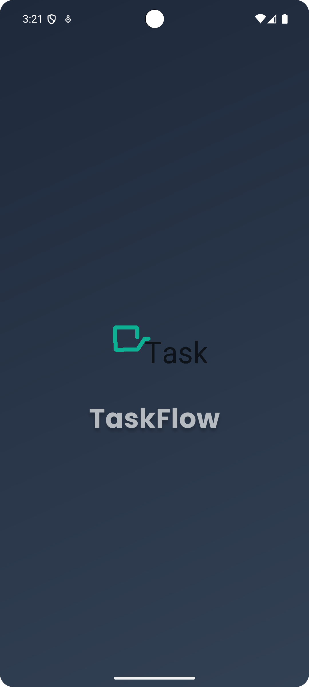  
🎭 A stylish **animated splash screen** welcomes users with the **TaskFlow logo**, setting a polished and professional tone.

### 📌 Main Screen (My Day)
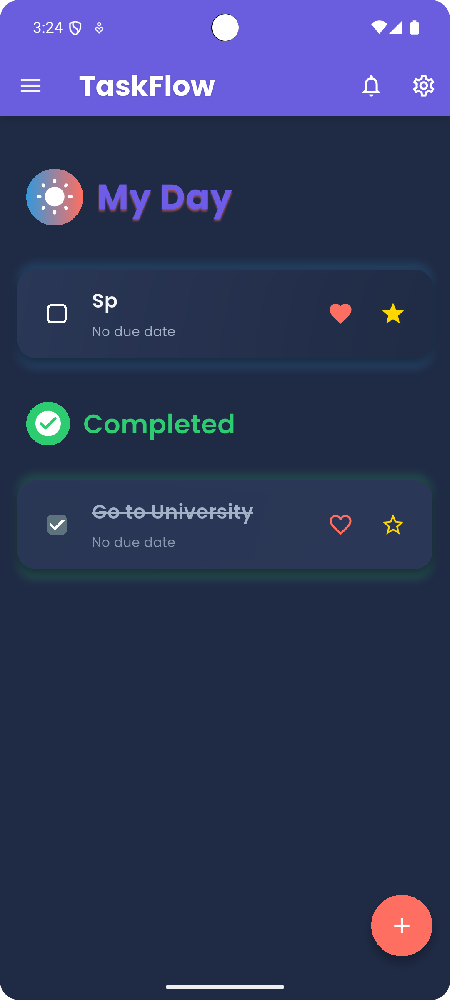 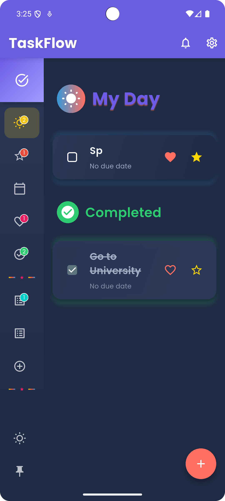 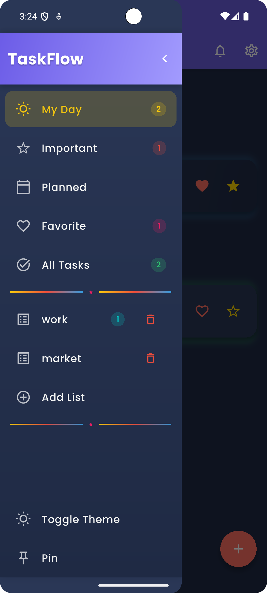  

🌞 A **daily planning hub** with a **collapsible sidebar** for smooth navigation, featuring:
- ✔️ Quick access to **Important, Planned, Favorites, All Tasks, and Custom Lists**.
- ✔️ **Task counts** for each category displayed in the sidebar.
- ✔️ **Pin/unpin** the sidebar for convenience.
- ✔️ Add **new tasks** via a floating action button (FAB).
- ✔️ **Track active and completed** tasks for the day.
- ✔️ Receive **notifications** for overdue tasks.
- ✔️ **Drag-and-drop** to reorder tasks within the section.

### ⭐ Important Screen
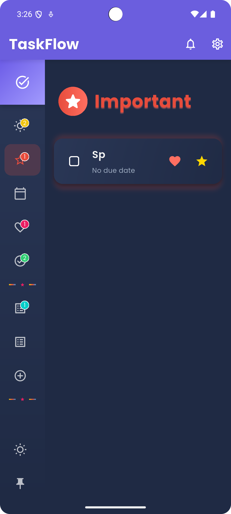 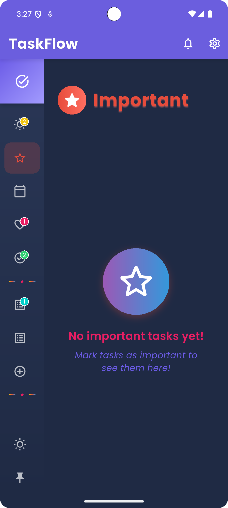  

🎯 Prioritize critical tasks by marking them as **Important** and view them in a dedicated section.
- ✔️ Separate **Active** and **Completed** important tasks.
- ✔️ **Drag-and-drop** to reorder tasks manually.
- ✔️ **Empty state** with a friendly message when no important tasks exist.

### 📅 Planned Screen
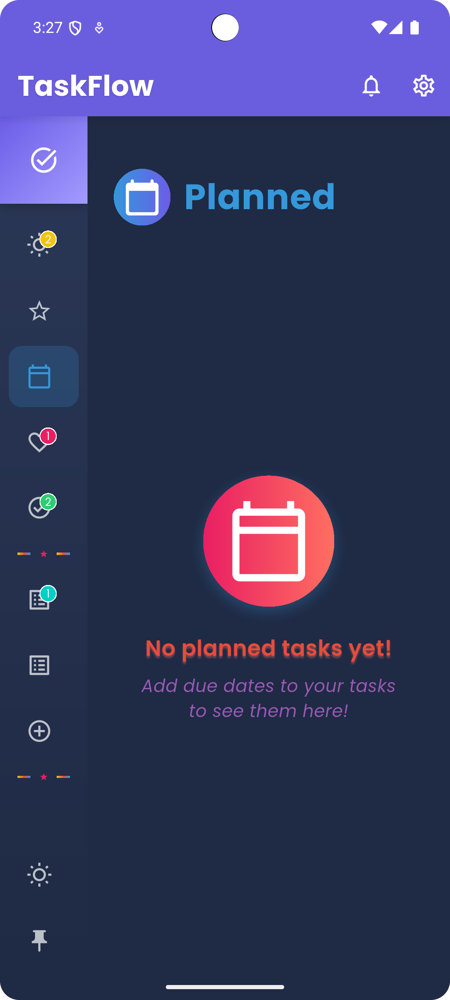  

📆 Organize tasks with **due dates** and track them in one place—ideal for deadline management.
- ✔️ Displays tasks sorted by due date.
- ✔️ Separate **Active** and **Completed** planned tasks.
- ✔️ **Drag-and-drop** to reorder tasks manually.
- ✔️ **Empty state** for when no tasks have due dates.

### ❤️ Favorite Screen
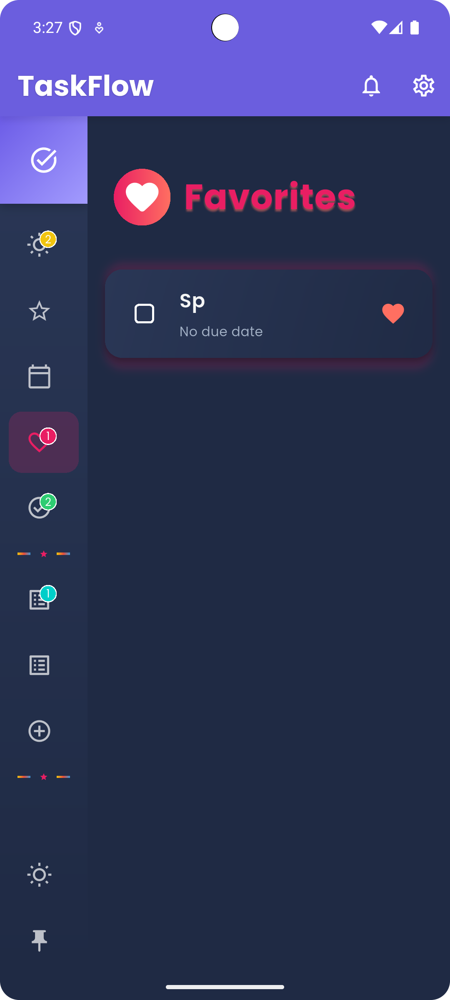  

💖 Save and quickly access **favorite tasks** with a simple toggle.
- ✔️ Separate **Active** and **Completed** favorite tasks.
- ✔️ **Drag-and-drop** to reorder tasks manually.
- ✔️ **Empty state** for when no tasks are marked as favorites.

### 📋 All Tasks Screen
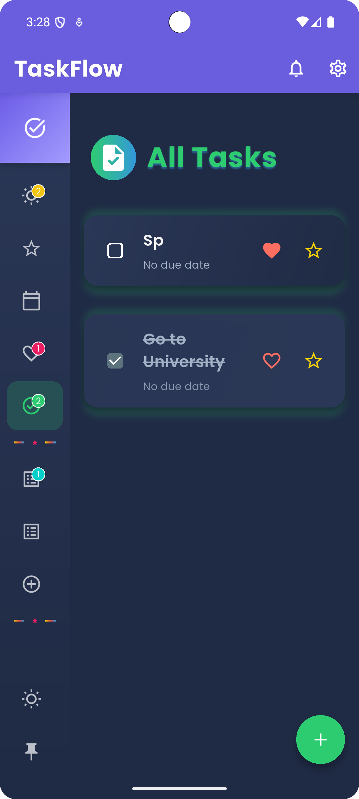  

📜 View every task in a **comprehensive list** with smooth gestures:
- ✔️ **Swipe right** ➝ Add to **My Day**.
- ✔️ **Swipe left** ➝ **Delete** the task.
- ✔️ FAB for **quick task creation**.
- ✔️ Separate **Active** and **Completed** tasks.
- ✔️ **Drag-and-drop** to reorder tasks manually.

### 🎨 Custom Task Lists
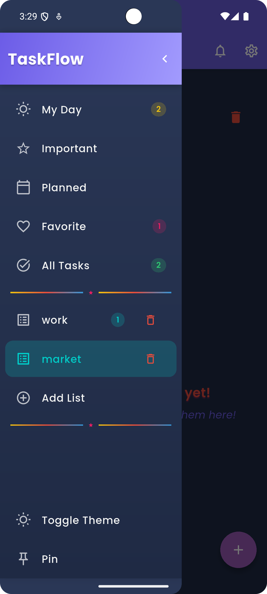  

🖌️ Create **personalized task lists** with custom names.
- ✔️ Add tasks to specific lists (e.g., Work, Personal).
- ✔️ **Drag-and-drop** to reorder tasks within each list.
- ✔️ **Sort tasks** by due date, alphabetical order, or manually.
- ✔️ Delete lists **with confirmation** to prevent accidental loss.
- ✔️ Accessible via the sidebar with task counts.

### ✏️ Task Editing
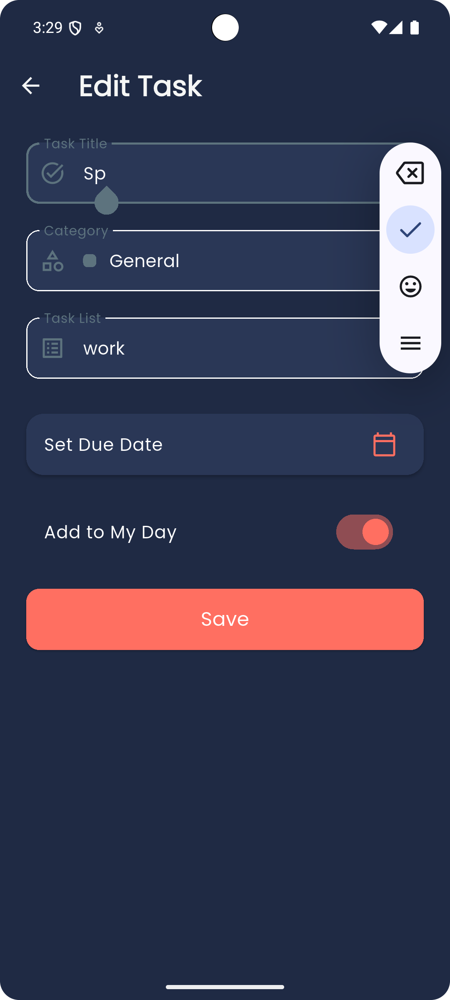  

📝 Create or update tasks with:
- ✔️ **Title, category (General, Work, Personal, Urgent), due date, and list assignment**.
- ✔️ Mark as **Important** or **Favorite**.
- ✔️ Add to **My Day** for daily focus.
- ✔️ Set **reminders** linked to due dates.
- ✔️ **Both new task creation and editing** supported.

### 🔔 Notifications
⏰ Get **local reminders** for scheduled and overdue tasks.  
🌍 Timezone-aware **custom alerts** ensure timely reminders.
- ✔️ Notifications for tasks added to **My Day** with due dates.
- ✔️ Alerts for overdue tasks across all categories.

### 🎭 Theme Switching
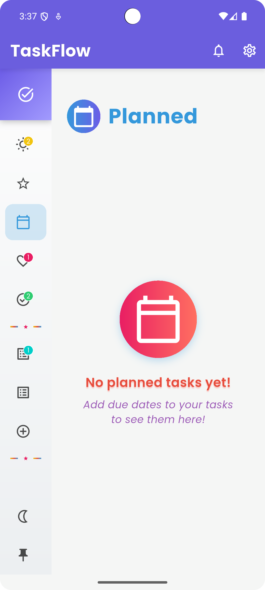   

🌞🌙 Toggle between **Light Mode** & **Dark Mode** in one tap!  
🎨 **Gradient themes** (#6C5CE7 to #A29BFE) make the UI look stunning.
- ✔️ Persistent theme settings saved across app restarts.

### 🎬 Animations
✨ Smooth transitions with:
- ✔️ **Fade effects** for page navigation.
- ✔️ **Animated containers** for task cards.
- ✔️ **Swipe gestures** for intuitive task management.
- ✔️ **Reorder animations** during drag-and-drop.
- ✔️ **Fade transitions** for screen changes using AnimatedSwitcher.

### 🔄 Drag-and-Drop Reordering
🔧 Reorder tasks within sections using **drag-and-drop** functionality:
- ✔️ Available in **My Day**, **Important**, **Planned**, **Favorites**, **All Tasks**, and **Custom Lists**.
- ✔️ Smooth animations during reordering with a shadow effect.
- ✔️ Persists the order using BLoC state management.

### ⚙️ Account Settings
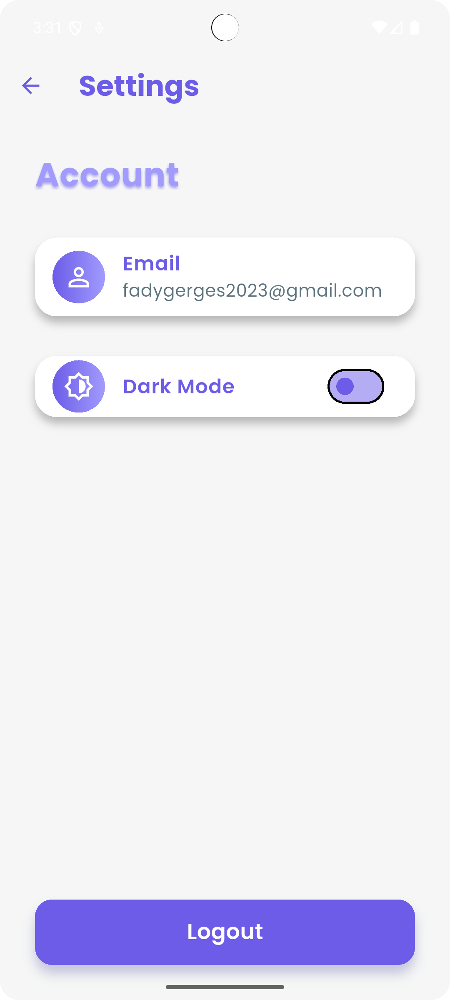  

🔧 Customize your experience:
- ✔️ Toggle **theme preferences** (Light/Dark Mode).
- ✔️ Manage **notification settings** for reminders.
- ✔️ Access app information and developer details.

---

## 🛠 Technologies Used
| Technology                     | Purpose                          |
|--------------------------------|----------------------------------|
| **Flutter**                    | UI framework for cross-platform apps |
| **Dart**                       | Programming language             |
| **Flutter BLoC**               | State management                 |
| **Google Fonts**               | Poppins for modern typography    |
| **Flutter Local Notifications**| For reminders & alerts           |
| **Provider**                   | Theme management                 |
| **UUID**                       | Generates unique task IDs        |
| **Intl**                       | Date formatting                  |
| **Timezone**                   | Accurate time-based notifications|

---

## 📥 Installation
💻 **Follow these steps to install TaskFlow on your system:**

1️⃣ **Clone the Repository**
```bash
git clone https://github.com/Fady2024/taskflow.git
cd taskflow
